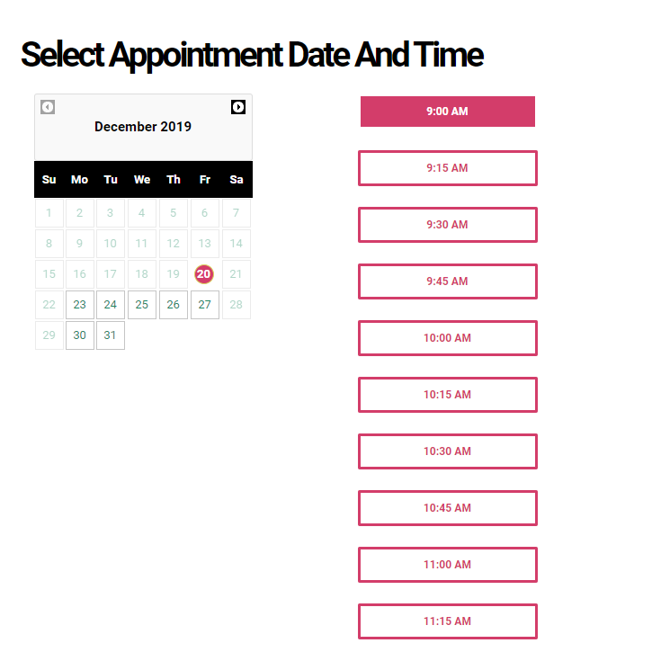

/* ----------------------------------------------------------------------------
 * @webSchedulr - Your comprehensive scheduling and calendar management solution
 *
 * @package     @webSchedulr - Online Appointments
 * @author      N N.Cara <nilo.cara@frontend.co.za>
 * @copyright   Copyright (c) Nilo Cara
 * @license     https://opensource.org/licenses/GPL-3.0 - GPLv3
 * @link        https://webschedulr.co.za
 * @since       v1.0.0
 * ---------------------------------------------------------------------------- */


<h1 align="center">
  <br>
  <a href="https://webschedulr.co.za">
    
  </a>
</h1>

<h4 align="center">
  Powerful. Self-Hosted. Your complete solution for scheduling and calendar management — built for modern teams.
</h4>

<p align="center">
  <a href="#about">About</a> •
  <a href="#features">Features</a> •
  <a href="#setup">Setup</a> •
  <a href="#installation">Installation</a> •
  <a href="#license">License</a>
</p>

<br>



## About

**webSchedulr is a sleek, open source appointment scheduling platform built for simplicity and adaptability. It lets your clients book appointments effortlessly through an intuitive web interface, while giving you full control over services, providers, and availability through a robust admin dashboard.

Perfect for solo professionals or teams, webSchedulr comes packed with everything you need to simplify scheduling. It integrates seamlessly with Google Calendar and can be installed easily on your current hosting environment.

## Features

- 📅 Appointment and customer management  
- 👥 Support for multiple providers and services  
- ⏰ Custom working hours and booking rules  
- 🔁 Google Calendar sync  
- ✉️ Email notifications  
- 🖥️ Self-hosted and lightweight  
- 🌍 Multilingual interface  
- 🤝 Community-supported and open source  

## Setup

```bash
# Clone the repo
git clone https://github.com/niloc95/webScheduler.git

# Enter the directory
cd webScheduler

# Install dependencies
npm install && composer install

# Start the development server
npm start
```

You can also create a production build:

```bash
npm run build
```


## Installation

To install **webSchedulr** on your server:

1. Ensure your server supports Apache/Nginx, PHP 8.2+, and MySQL.
2. Create a database or use an existing one.
3. Upload the source folder to your server.
4. Make sure the `storage/` directory is writable.
5. Rename `config-sample.php` to `config.php` and update with your environment settings.
6. Visit your app URL and follow the installation wizard.

🎉 That’s it! You’re ready to start scheduling.

## License

- **Code**: [GPL v3.0](https://www.gnu.org/licenses/gpl-3.0.en.html)  
- **Content**: [CC BY 3.0](https://creativecommons.org/licenses/by/3.0/)

---

Website [frontend.co.za](https://frontend.co.za) •  
GitHub [@nilo95](https://github.com/niloc95)
